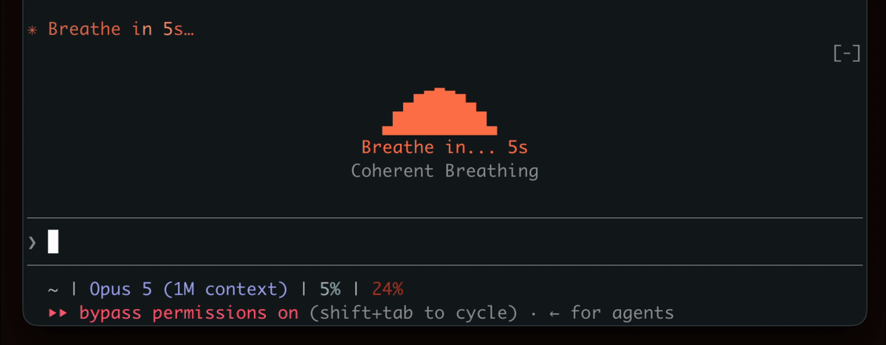

# Legacy: the tmux version

This is the original Mindful Breathing extension, built on shell hooks and a tmux pane. It still works, but the [Claude Mod](../README.md) in the repository root replaces it: no tmux, no jq, no edits to `settings.json`. Kept here for anyone who wants the pure-bash version.

Every prompt you send to Claude gives you 10-60+ seconds of dead time. Stop wasting it.

This extension turns Claude's thinking time into guided breathing exercises. It auto-launches in your terminal when Claude starts working and disappears when it's done. You stay in flow, your nervous system gets a workout, and you never leave your terminal.

## Why

Slow, structured breathing at ~5.5 breaths per minute increases heart rate variability (HRV), a key biomarker of stress resilience and cardiovascular health. Even brief sessions reduce cortisol and sharpen focus. Every prompt becomes a micro-session for your nervous system.

## What You Get

- **4 breathing exercises** (see below)
- **4 animation styles**: Pulse (gradient bars), Ripples (concentric lines), Dots (scattered particles), Wave (bell curve)
- **Auto-launch**: Breathing starts after a configurable delay (default 5s) when Claude is working
- **Auto-dismiss**: Animation closes the moment Claude finishes
- **Non-blocking**: Opens in a tmux pane below your session, doesn't steal focus

## Demo



## Quick Start

Requires **tmux**. macOS and Linux only.

```bash
# Install tmux if you don't have it
brew install tmux    # macOS
# apt install tmux   # Linux

git clone https://github.com/halluton/Mindful-Claude.git
cd Mindful-Claude
./install.sh
```

The installer adds hooks to `~/.claude/settings.json`, creates a config at `~/.claude/mindful/config`, and installs the `/mindful` slash command. Requires `jq`.

Start a Claude Code session inside tmux and the breathing animation will appear automatically.

> **Tip:** If you want mouse scrolling in tmux, add `set -g mouse on` to your `~/.tmux.conf` and reload with `tmux source-file ~/.tmux.conf`.

## `/mindful` Slash Command

Type `/mindful` in any Claude Code session to view status and change settings: toggle on/off, switch exercise, or adjust the delay.

### Exercises

| Exercise | Pattern | Best For |
|---|---|---|
| **Coherent Breathing** | 5.5s in / 5.5s out | Sustained HRV improvement |
| **Physiological Sigh** | Double inhale / long exhale | Quick calm-down |
| **Box Breathing** | 4s in / 4s hold / 4s out / 4s hold | Focus and concentration |
| **4-7-8 Breathing** | 4s in / 7s hold / 8s out | Deep relaxation |

## How It Works

```
You send a prompt to Claude Code
         |
         v
    on-start.sh fires
    |-- Checks ~/.claude/mindful/config, exits if disabled
    |-- Creates marker file /tmp/mindful-claude-working
    '-- Launches open-tmux-popup.sh in background
         |
         v
    open-tmux-popup.sh waits 5 seconds
    |-- If Claude is still working: opens breathe.sh in a tmux pane
    '-- If Claude already finished: exits silently
         |
         v
    Claude finishes, on-stop.sh fires
    |-- Removes marker file
    '-- Kills the breathing pane
```

## Configuration

### Config File

Settings are stored in `~/.claude/mindful/config`:

```
enabled=true
exercise=0
delay=5
```

### Environment Variables

Environment variables override the config file. Set these in `.zshrc` or `.bashrc`:

| Variable | Default | Description |
|---|---|---|
| `MINDFUL_TMUX_UI` | `pane` | UI mode: `pane` (non-blocking split), `popup` (centered overlay), `off` |
| `MINDFUL_DELAY_SECONDS` | config `delay` | Seconds to wait before showing breathing animation |

## Manual Installation

If you don't want to use the installer, you can set it up manually. Requires **tmux**. macOS and Linux only.

1. Install tmux if you don't have it:

```bash
brew install tmux    # macOS
# apt install tmux   # Linux
```

2. Make scripts executable:

```bash
chmod +x breathe.sh set-exercise.sh hooks/*.sh
```

3. Add the hooks to your Claude Code settings. Edit `~/.claude/settings.json`:

```json
{
  "hooks": {
    "UserPromptSubmit": [
      {
        "command": "/full/path/to/hooks/on-start.sh"
      }
    ],
    "Stop": [
      {
        "command": "/full/path/to/hooks/on-stop.sh"
      }
    ]
  }
}
```

Use full absolute paths.

4. (Optional) Install the `/mindful` slash command:

```bash
mkdir -p ~/.claude/commands
cp commands/mindful.md ~/.claude/commands/mindful.md
```

5. Change exercise from the terminal:

```bash
./set-exercise.sh hrv    # Coherent Breathing (5.5s in, 5.5s out)
./set-exercise.sh sigh   # Physiological Sigh (double inhale + long exhale)
./set-exercise.sh box    # Box Breathing (4s in, 4s hold, 4s out, 4s hold)
./set-exercise.sh 478    # 4-7-8 Breathing (4s in, 7s hold, 8s out)
```

6. Start a Claude Code session inside tmux.

## License

MIT. See [LICENSE](LICENSE) for details.
